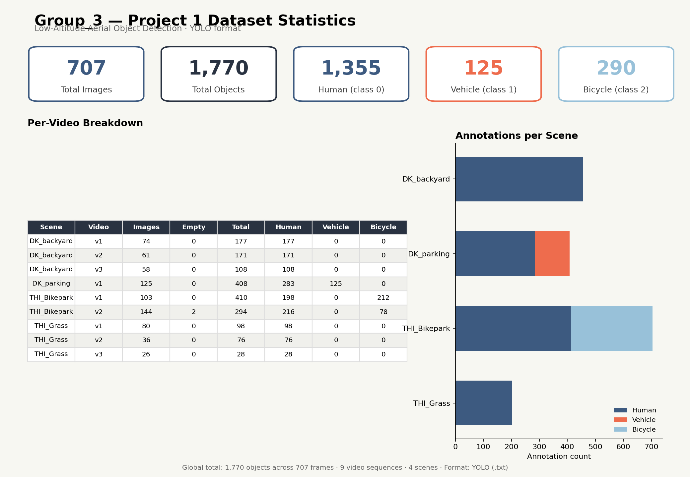
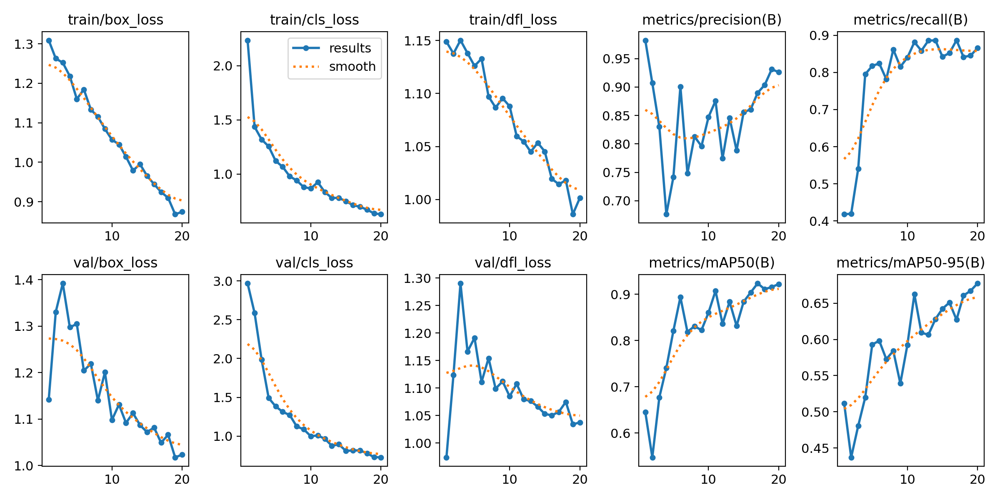
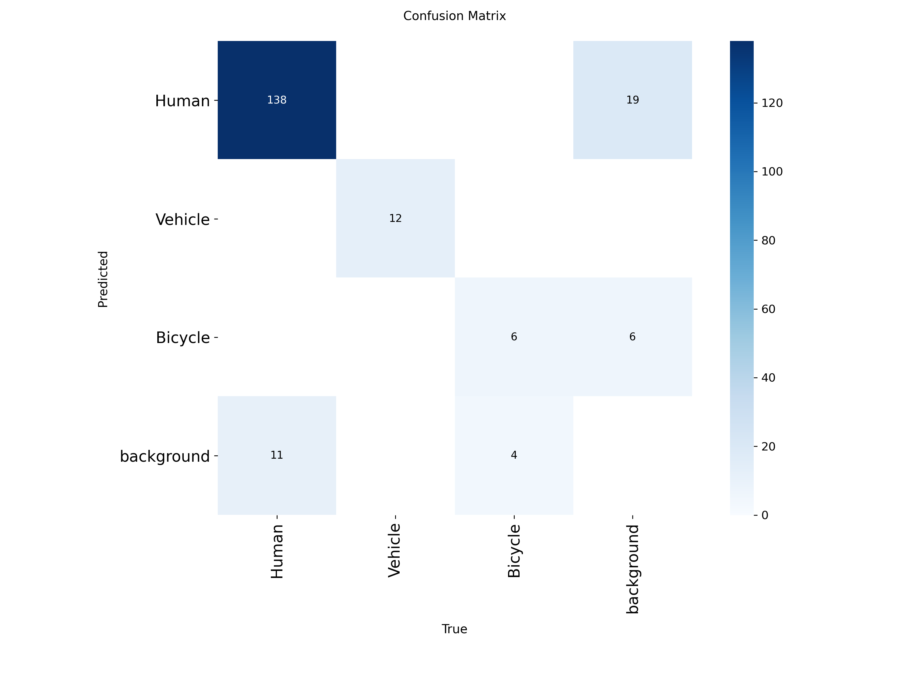
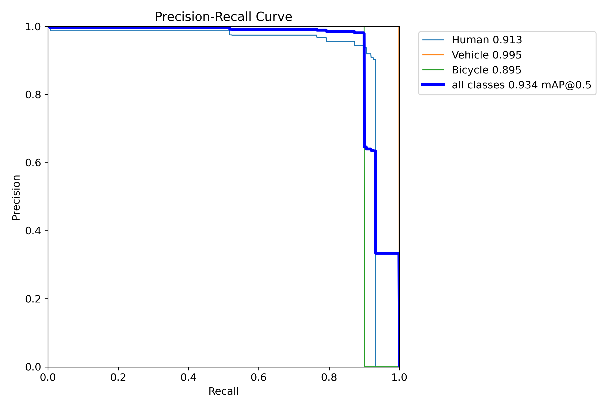

# Low-Altitude Aerial Object Detection with YOLOv8

Detecting **Human**, **Vehicle**, and **Bicycle** in low-altitude (3–9 m) drone footage using a fine-tuned YOLOv8 detector.

> **Project 1 · Group 3** — MDM-M-1 Machine Vision (SS26), THD × THI
> Mostafa Mohamed · Mohammad Reza Azadi Tinat · Mohamed Fares · Asem Marwad
> Instructor: Prof. Dr. Survaiya

---

## Overview

Public UAV benchmarks (VisDrone, UAVDT) are captured from 10–30 m. Our footage sits in the **3–9 m** blind spot — a near-eye, oblique viewing angle that off-the-shelf models were never trained on. This repository contains the full pipeline we built to close that gap: dataset auditing and correction, a leakage-safe train/val/test split, YOLOv8n training, evaluation, and a live inference demo.

The trained model reaches **mAP@0.5 = 0.934** and **mAP@0.5:0.95 = 0.576** on a held-out test set.

### Highlights

- **Data-quality audit that mattered.** The original annotation export contained **zero** Vehicle labels despite a parked car visible in all 125 frames of one scene. We caught this before training and recovered it from **0 → 125** instances (re-annotation + linear interpolation of the 5 missing frames).
- **Leakage-safe splitting.** Because consecutive video frames are near-duplicates, we split each sequence into **contiguous temporal blocks** (80/10/10) rather than shuffling randomly, so near-identical frames never leak across train/val/test.
- **Reproducible submission format.** A build script restructures the data into the instructor-mandated `images/` + `annotations/` layout without touching the training pipeline.

---

## Dataset

| Property | Value |
|---|---|
| Frames | 707 (3840×2160, 4K) |
| Labelled objects | 1,770 |
| Video sequences | 9 |
| Scenes | 4 (DK_backyard, DK_parking, THI_Bikepark, THI_Grass) |
| Classes | `0` Human · `1` Vehicle · `2` Bicycle |

**Per-class instances:** Human 1,355 (76.6%) · Bicycle 290 (16.4%) · Vehicle 125 (7.1%)

Vehicles appear only in `DK_parking` and bicycles only in `THI_Bikepark`, which is why the split is designed to force every class into all three sets.



---

## Repository structure

```
.
├── src/
│   ├── prepare_dataset.py           # build train/val/test manifests + data.yaml (run first)
│   ├── train.py                     # fine-tune YOLOv8n
│   ├── evaluate.py                  # evaluate on the test split, write metrics + plots
│   ├── predict_photo.py             # live-webcam / single-image inference demo
│   ├── build_submission.py          # assemble the Group_3/ submission tree (+ zip)
│   ├── interpolate_missing_vehicle.py  # fill 5 missing Vehicle boxes by interpolation
│   ├── dataset_stats.py             # text report of dataset statistics
│   └── dataset_dashboard.py         # one-page PNG statistics dashboard
├── dataset/                         # generated: data.yaml, splits/, yolo_view/ (git-ignored)
├── Group_3/                         # generated submission tree (git-ignored)
├── figures/                         # report figures
├── runs/                            # training/eval outputs (git-ignored)
├── requirements.txt
└── README.md
```

---

## Installation

Requires Python 3.9+.

```bash
git clone https://github.com/<your-username>/<your-repo>.git
cd <your-repo>

python -m venv .venv
source .venv/bin/activate        # Windows: .venv\Scripts\activate

pip install -r requirements.txt
```

If you don't have a `requirements.txt` yet, this is the minimal set:

```
ultralytics>=8.0.0
opencv-python
matplotlib
```

> **Note on hardware.** All results in this repo were produced on **CPU** (the available GPU was capped at CUDA 11, below the minimum for current PyTorch builds). Training runs on GPU unchanged — pass `--device 0` to `train.py` / `evaluate.py`.

---

## Usage

Run scripts from the repository root.

### 1. Prepare the dataset

Builds the leakage-safe train/val/test manifests and writes `dataset/data.yaml`.

```bash
python src/prepare_dataset.py
```

### 2. Train

Fine-tunes YOLOv8n (COCO-pretrained) for 20 epochs at 640×640.

```bash
python src/train.py --epochs 20 --imgsz 640 --batch 16 --device cpu
```

Weights are written to `runs/train/<name>/weights/best.pt`.

### 3. Evaluate

Reports per-class precision / recall / mAP50 / mAP50-95 on the held-out **test** split and saves the confusion matrix, PR curve, and an evaluation dashboard.

```bash
python src/evaluate.py --weights runs/train/d_yolo_exp2/weights/best.pt
```

### 4. Run the live demo

Opens a webcam (SPACE to capture, ESC to cancel) or takes an existing image, then prints each detection and saves an annotated copy.

```bash
# webcam
python src/predict_photo.py --weights runs/train/d_yolo_exp2/weights/best.pt

# existing photo
python src/predict_photo.py --weights runs/train/d_yolo_exp2/weights/best.pt --image path/to/photo.jpg
```

### Utility scripts

```bash
python src/dataset_stats.py          # text statistics report
python src/dataset_dashboard.py      # PNG statistics dashboard
python src/build_submission.py       # rebuild the Group_3/ submission tree + zip
```

---

## Results

Held-out **test set** (70 images):

| Class | Precision | Recall | mAP@0.5 | mAP@0.5:0.95 |
|---|---|---|---|---|
| Human | 0.917 | 0.919 | 0.913 | 0.594 |
| Vehicle | 1.000 | 1.000 | 0.995 | 0.872 |
| Bicycle | 0.882 | 0.900 | 0.895 | 0.263 |
| **Overall** | **0.933** | **0.940** | **0.934** | **0.576** |

**Reading the numbers:** mAP@0.5 asks *"did we find the object?"*; mAP@0.5:0.95 also asks *"is the box tight?"*. The gap is driven mostly by Bicycle (0.895 → 0.263) — the model finds bicycles but doesn't localize them tightly, as expected for the rarest, thinnest class.

<p align="center">
  <br>
  
  
</p>

---

## Method notes

**Model.** YOLOv8n (nano) — ~3.01M parameters, 8.2 GFLOPs — fine-tuned from COCO-pretrained weights. Nano was chosen for the CPU-only constraint and the small dataset size, where a larger model would mostly overfit.

**Training config.** 20 epochs · 640×640 · batch 16 · AdamW (lr ≈ 0.0014) · early-stopping patience 10 (never triggered) · ~56 min total on an Intel Core i7-10750H.

**Vehicle recovery.** 120 of 125 `DK_parking` frames were re-annotated with corrected Human+Vehicle labels; the 5 remaining frames were filled by **linear interpolation** of the parked car's box between annotated neighbours (valid because the car is stationary and only the drone moves).

---

## Limitations

- **Vehicle is not "solved".** All 125 Vehicle instances are the *same parked car*, so the near-perfect Vehicle score reflects memorization of one object, not general vehicle detection.
- **Background scarcity.** Only 2 of 707 frames (0.3%) are empty negatives, well below the ~15% target — this raises false positives on genuinely empty scenes.
- **Class imbalance** (77 / 16 / 7%) likely explains Bicycle's weak strict-localization score.
- **Few source videos per class**, so generalization claims are kept modest.

**Future work:** collect diverse vehicles from multiple sites, add more empty negatives, train larger variants (YOLOv8s/m) on GPU for longer, and run a cross-scene domain-shift test (train on DK, test on THI).

---

## Acknowledgment

We thank Prof. Dr. Survaiya for guidance and dataset annotation specifications throughout this project.

## References

- G. Jocher, A. Chaurasia, J. Qiu, *YOLOv8 by Ultralytics*, 2023. https://github.com/ultralytics/ultralytics
- J. Redmon et al., *You Only Look Once: Unified, Real-Time Object Detection*, CVPR 2016.
- T.-Y. Lin et al., *Microsoft COCO: Common Objects in Context*, ECCV 2014.

## License

<!-- Pick one and add a LICENSE file. MIT is a common default for academic code. -->
Released under the MIT License — see `LICENSE` for details.
